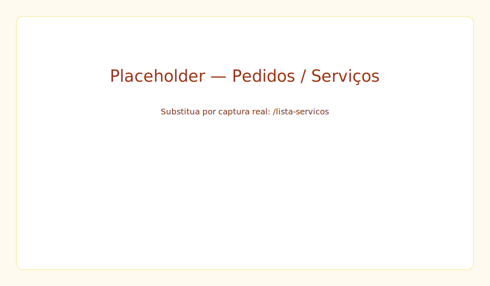
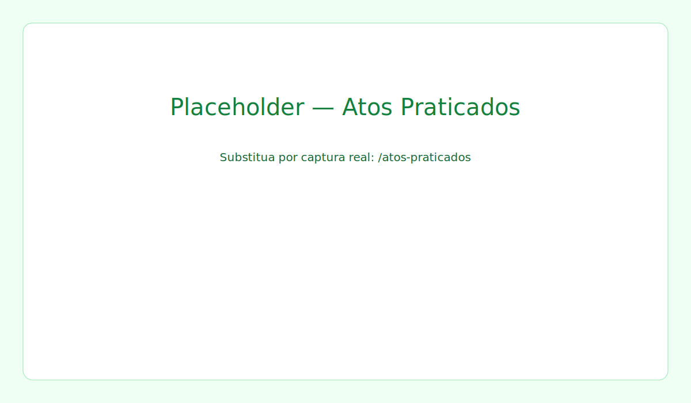
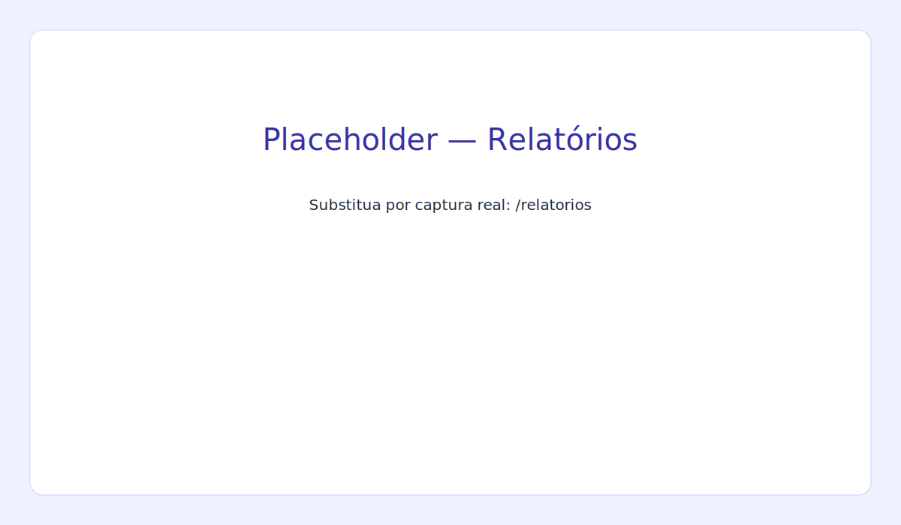
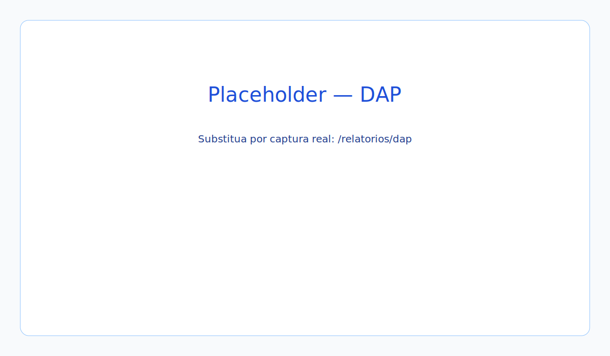
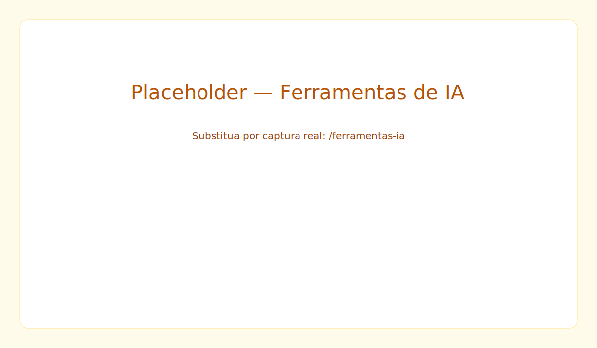
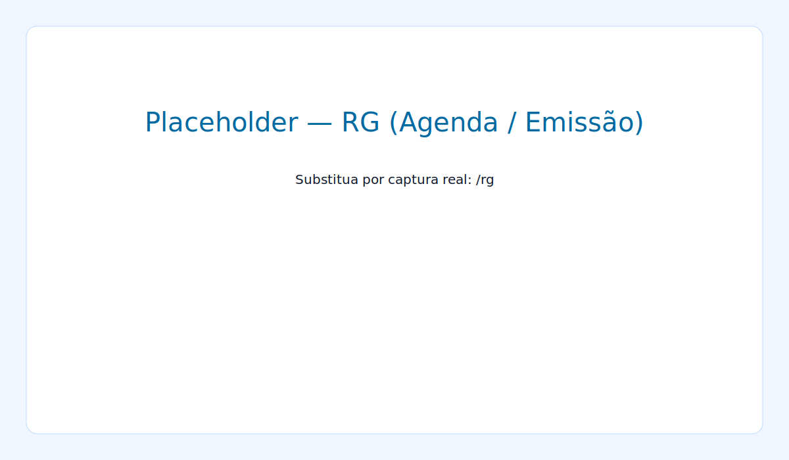

# Manual do Usuário — Sistema Auxiliar do RCPN v2.0

Este manual explica, passo a passo, como usar as funcionalidades principais do sistema. Ele segue a organização dos hubs exibidos em `Home2.jsx`.

Índice
- CAIXA
- PEDIDOS / SERVIÇOS
- ATOS PRATICADOS
- RELATÓRIOS
- DAP
- FERRAMENTAS DE IA
- RG (Carteira de Identidade)
- Dicas e solução de problemas rápidos

---

**CAIXA** (Acessar: menu → CAIXA)

Objetivo: registrar e controlar movimentos financeiros diários, emitir fechamento de caixa e gerar relatórios.

Principais telas:
- `CaixaHub` — ponto de entrada (menu `/caixa`).
- `CaixaDiario` — registrar lançamentos, ver totais e fechar o caixa.
- `EntradasSaidasManuais` — inserir entradas/saídas rápidas.
- `CaixaInputs` / `ResumoCaixa` — painel com valores iniciais, entradas, saídas e valor final.
- `Fechamento` / `FechamentoDiarioButton` — realizar o fechamento do dia.

Como usar — fluxo típico:
1. Abra o hub do caixa (`/caixa`) e clique em "MOVIMENTO DIÁRIO DO CAIXA" para abrir `/caixa-diario`.
2. Selecione a data desejada no seletor de data.
3. Carregar lançamentos: o sistema busca os atos/pagamentos do backend automaticamente.
4. Para adicionar uma ENTRADA manual: preencha valor e observação em "Entradas" e clique em "Adicionar Entrada" (ou use o formulário rápido).
   - Entradas manuais geram registros com código `0003`.
5. Para adicionar uma SAÍDA manual: preencha valor, observação (e opcionalmente nome do cliente/ticket) e clique em "Adicionar Saída".
   - Saídas manuais geram registros com código `0002`.
6. Verifique o resumo do caixa no painel `CaixaInputs` (valor inicial, entradas, saídas, valor final).
7. Para fechar o caixa: clique em "Fechamento Diário". O sistema verifica duplicatas e grava um ato de código `0001` com o valor final calculado.
8. Gerar relatórios: acesse `RelatoriosCaixaDiario` para exportar ou imprimir.

Boas práticas e observações:
- Antes de fechar, confirme que todos os lançamentos do dia foram registrados.
- Para reverter lançamentos criados localmente sem ID, remova-os da lista; para removê-los do backend use a ação de excluir (quando o registro tiver `id`).

Captura de tela (placeholder):

Arquivos relevantes:
- `CaixaHub`: [src/CaixaHub.jsx](src/CaixaHub.jsx#L1)
- `CaixaDiario`: [src/CaixaDiario.jsx](src/CaixaDiario.jsx#L1)
- `CaixaInputs`: [src/CaixaInputs.jsx](src/CaixaInputs.jsx#L1)
- `EntradasSaidasManuais`: [src/EntradasSaidasManuais.jsx](src/EntradasSaidasManuais.jsx#L1)
- `Fechamento`: [src/Fechamento.jsx](src/Fechamento.jsx#L1)
- `FechamentoDiarioButton`: [src/FechamentoDiarioButton.jsx](src/FechamentoDiarioButton.jsx#L1)

---

**PEDIDOS / SERVIÇOS** (Acessar: menu → PEDIDOS)

Objetivo: gerenciar o ciclo completo de pedidos — cadastro, pagamento, execução e emissão de recibos.

Principais telas:
- Hub de pedidos (rota `/lista-servicos` ou equivalente)
- `ReciboPedido` — gerar recibos
- `UploadForm` — anexar documentos ao pedido
- `UsuarioInfo` — visualizar/editar dados do cliente

Como usar — fluxo típico:
1. Abra o hub de pedidos e clique em "Novo Pedido" (ou selecione um existente para editar).
2. Preencha os campos do pedido: serviço, cliente, observações e valores.
3. Anexe arquivos se necessário (componente `UploadForm`).
4. Registrar pagamento: marque o pedido como pago e selecione a forma de pagamento.
5. Emitir recibo: use `ReciboPedido` para visualizar/imprimir.
6. Acompanhar execução: marque etapas (em execução, pronto, entregue).

Dicas:
- Use `UsuarioInfo` para preencher rapidamente dados do cliente em pedidos repetidos.
- Usuários com permissão de admin podem acessar `UsuariosAdmin` para gerenciar operadores.

Captura de tela (placeholder):

Arquivos relevantes:
- `ReciboPedido`: [src/ReciboPedido.jsx](src/ReciboPedido.jsx#L1)
- `UploadForm`: [src/UploadForm.jsx](src/UploadForm.jsx#L1)
- `UsuarioInfo`: [src/UsuarioInfo.jsx](src/UsuarioInfo.jsx#L1)
- `UsuariosAdmin`: [src/UsuariosAdmin.jsx](src/UsuariosAdmin.jsx#L1)

---

**ATOS PRATICADOS** (Acessar: menu → ATOS PRATICADOS)

Objetivo: listar, pesquisar, importar e conciliar atos registrados/registráveis.

Principais telas:
- `AtosHub` — hub de navegação
- `AtosPraticados` — lista detalhada e operações (remoção, fechamento, geração de relatório)
- `TabelaAtos` — visualização tabular
- `ImportarAtos` — importar arquivos
- `Conciliacao` — comparar e conciliar dados

Como usar — fluxo típico:
1. Abra `/atos-praticados` para ver a lista do dia ou de um período selecionado.
2. Use o seletor de data e o campo de busca (`AtoSearch` / `AtoSearchAtosPraticados`) para filtrar por tipo, escrevente ou descrição.
3. Registrar pagamento/manual: selecione um ato e use as ações de pagamento ou marcação.
4. Importação: para importar lotes, abra `ImportarAtos`, selecione o arquivo (CSV/XLS) e execute a importação.
5. Conciliação: abra `Conciliacao` para comparar um conjunto importado com a base e aceitar/rejeitar correspondências.
6. Remoção: ao excluir um ato com `id`, o sistema fará DELETE no backend; atos apenas locais (sem `id`) são removidos localmente.

Captura de tela (placeholder):

Arquivos relevantes:
- `AtosHub`: [src/AtosHub.jsx](src/AtosHub.jsx#L1)
- `AtosPraticados`: [src/AtosPraticados.jsx](src/AtosPraticados.jsx#L1)
- `TabelaAtos`: [src/TabelaAtos.jsx](src/TabelaAtos.jsx#L1)
- `ImportarAtos`: [src/ImportarAtos.jsx](src/ImportarAtos.jsx#L1)
- `Conciliacao`: [src/Conciliacao.jsx](src/Conciliacao.jsx#L1)
- `AtoBuscaEPagamento`: [src/AtoBuscaEPagamento.jsx](src/AtoBuscaEPagamento.jsx#L1)
Boas práticas:
- Ao importar, revise o mapeamento de colunas antes de confirmar.
- Use a função de conciliação para reduzir divergências entre DAPs e atos praticados.

---

**RELATÓRIOS** (Acessar: menu → RELATÓRIOS)

Objetivo: gerar relatórios de atos, DAPs, caixa e relatórios específicos (CNJ, RG).

Principais telas:
- `Relatorios` — hub principal
- `RelatorioCNJ` — relatórios formatados para CNJ
- `RelatoriosCaixaDiario` — relatórios do caixa
- `RGRelatorioFinanceiro` — relatórios do módulo RG

Como usar — fluxo típico:
1. Abra o hub de relatórios e escolha o tipo desejado.
2. Selecione filtros: período, serventia, usuário, tipo de ato.
3. Gere e exporte: clique em "Gerar" e exporte em PDF/CSV conforme disponível.
4. Para relatórios periódicos (ex.: mensal), salve os filtros para reutilizar.

Dicas:
- Para somatórios rápidos do dia, use relatórios do caixa; para requisitos legais, use o formato CNJ.

Captura de tela (placeholder):

Arquivos relevantes:
- `Relatorios`: [src/Relatorios.jsx](src/Relatorios.jsx#L1)
- `RelatorioCNJ`: [src/RelatorioCNJ.jsx](src/RelatorioCNJ.jsx#L1)
- `RelatoriosCaixaDiario`: [src/RelatoriosCaixaDiario.jsx](src/RelatoriosCaixaDiario.jsx#L1)
- `RGRelatorioFinanceiro`: [src/RGRelatorioFinanceiro.jsx](src/RGRelatorioFinanceiro.jsx#L1)

---

**DAP** (Acessar: menu → RELATÓRIOS → DAP)

Objetivo: processar, validar e gerar DAPs (Declarações de Arrecadação e Pagamento).

Principais telas / ações:
- Upload de PDF/arquivo DAP (`UploadForm`)
- Visualização/parse via integração com backend
- Comparação/retificadora e geração de arquivos para envio

Fluxo de uso:
1. Acesse `/relatorios/dap` e selecione "Novo DAP" ou "Importar".
2. Faça upload do PDF da declaração usando `UploadForm`.
3. Aguarde o processamento. O backend fará o parse e retornará os atos detectados.
4. Verifique mapeamento de códigos, valores e datas; corrija manualmente se necessário.
5. Gere retificadora quando necessário ou exporte os sumários.

Observações técnicas:
- O parsing de PDF é feito pelo backend; o frontend envia o arquivo e exibe o resultado.

Captura de tela (placeholder):

Arquivos/recursos relevantes:
- `UploadForm`: [src/UploadForm.jsx](src/UploadForm.jsx#L1)
- DAP backend endpoints: ver `backend_dev` rotas relacionadas (ex.: `/api/dap`)

---

**FERRAMENTAS DE IA** (Acessar: menu → FERRAMENTAS DE IA)

Objetivo: utilitários que usam modelos/IA para acelerar tarefas (extração de texto, sumarização, prompts).

Principais telas:
- `FerramentasIA` — hub de utilitários de IA
- `ConfigurarIA` — inserir chaves e preferências
- `ConfigurarServentia` — parâmetros por serventia

Como usar — passos básicos:
1. Abra `ConfigurarIA` e insira a chave da API do provedor (ex.: GEMINI_API_KEY) se solicitado.
2. No hub `FerramentasIA`, escolha a ferramenta: extrair texto de PDF, executar um prompt, gerar resumo de um documento.
3. Para extrair texto: faça upload do PDF e clique em "Extrair" — revise o texto extraído.
4. Para prompts/assistentes: escolha o agente, preencha o prompt e envie.

Boas práticas:
- Mantenha as chaves seguras (não as compartilhe).
- Ajuste limites e tamanho de respostas nas configurações para evitar custos excessivos.

Captura de tela (placeholder):

Arquivos relevantes:
- `FerramentasIA`: [src/FerramentasIA.jsx](src/FerramentasIA.jsx#L1)
- `ConfigurarIA`: [src/ConfigurarIA.jsx](src/ConfigurarIA.jsx#L1)
- `ConfigurarServentia`: [src/ConfigurarServentia.jsx](src/ConfigurarServentia.jsx#L1)

---

**RG (Carteira de Identidade)** (Acessar: menu → RG)

Objetivo: gerenciar emissão de RGs, agenda de atendimentos e integração financeira do serviço.

Principais telas:
- `RG` — hub principal
- `RGAgenda` — agenda de atendimentos
- `RGCaixa` — integração financeira do RG
- `RGRelatorioFinanceiro` — relatórios e extração de valores

Como usar — fluxo típico:
1. Abra o hub `RG` e acesse `RGAgenda` para ver os agendamentos.
2. Para agendar atendimento: clique em "Novo Agendamento" e preencha dados do requerente.
3. Ao emitir RG, registre o pagamento ou integre no fluxo do caixa (via `RGCaixa`).
4. Gere relatórios financeiros específicos pelo módulo RG.

Dicas:
- Verifique os campos obrigatórios antes de confirmar emissão para evitar retrabalho.

Captura de tela (placeholder):

Arquivos relevantes:
- `RG`: [src/RG.jsx](src/RG.jsx#L1)
- `RGAgenda`: [src/RGAgenda.jsx](src/RGAgenda.jsx#L1)
- `RGCaixa`: [src/RGCaixa.jsx](src/RGCaixa.jsx#L1)
- `RGRelatorioFinanceiro`: [src/RGRelatorioFinanceiro.jsx](src/RGRelatorioFinanceiro.jsx#L1)

---

Dicas gerais e solução de problemas
- Limpar cache/localStorage: se a interface não refletir alterações, tente limpar `localStorage` (especialmente o item `usuario` e `token`).
- Erro ao salvar: verifique se o token de autenticação está presente (`localStorage.token`).
- Uploads grandes: prefira arquivos compactados ou use a integração de armazenamento (Backblaze/OneDrive) quando disponíveis.
- Logs para diagnóstico: abra o console do navegador para ver chamadas `fetch` e respostas de erro do backend.

Como obter ajuda
- Consulte o arquivo `README` do projeto e as rotas em `src/` para detalhes técnicos.
- Para problemas de backend, verifique `backend_dev/server.js` e rotas relacionadas (`/api/*`).

---

Se desejar, posso:
- Gerar uma versão com captura de telas (placeholder) de cada fluxo.
- Adicionar links diretos com números de linha para os arquivos de componente citados.
- Produzir um PDF formatado a partir deste manual.

